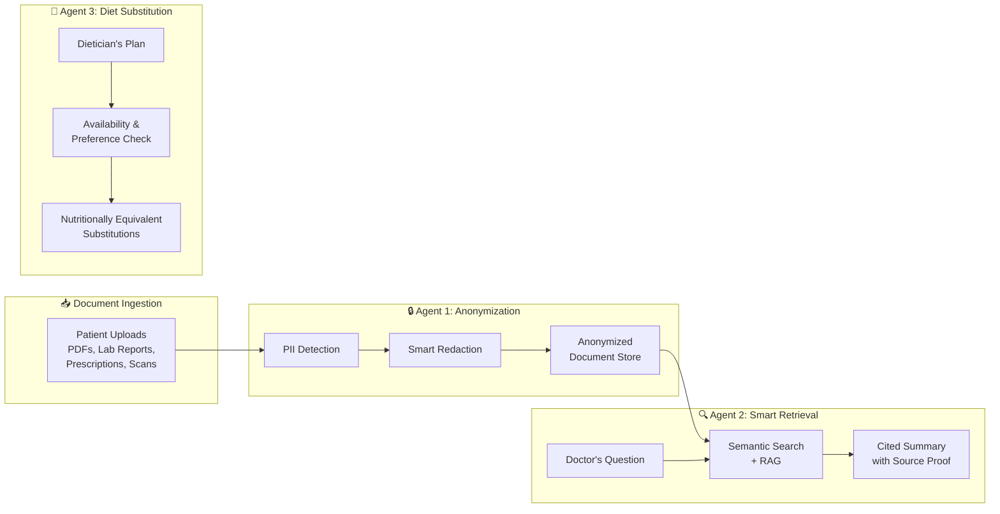
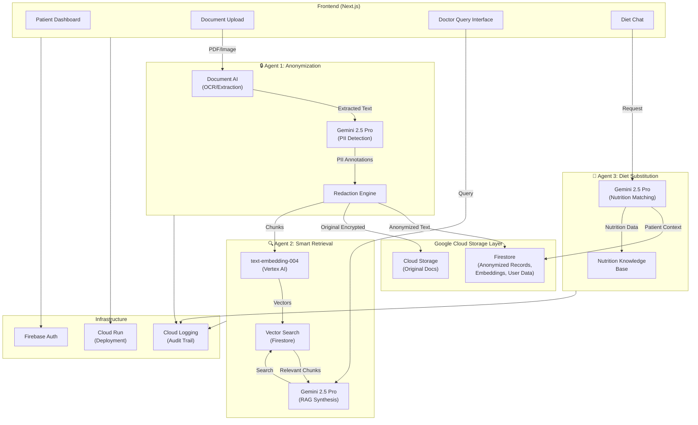

# 🏥 MedSync AI — Implementation Plan (v2)

> **Agent Arena Bangalore 2026 | Track B: Enterprise Agent Engineering**
> A 3-agent medical continuity platform for pregnant women and chronic illness patients.

---

## Architecture: The 3-Agent Pipeline



---

## Agent 1: 🔒 Anonymization Agent

### Purpose
When medical documents are uploaded, this agent identifies and redacts Personally Identifiable Information (PII) before storage — ensuring compliance and safe sharing with new doctors.

### What It Detects & Redacts

| PII Category | Examples | Redaction Strategy |
|---|---|---|
| **Direct Identifiers** | Name, Aadhaar, phone, email | Full redaction → `[REDACTED_NAME]` |
| **Quasi-Identifiers** | DOB, address, employer | Generalize → age range, city-level |
| **Medical Identifiers** | MRN, insurance ID, hospital reg no. | Token replacement → `[ID_TOKEN_7a3f]` |
| **Contextual PII** | Doctor names, hospital names in notes | Configurable — redact or preserve |

### Technical Design

```
Patient uploads document (PDF/image/text)
        │
        ▼
┌─────────────────────────────┐
│  Document AI (OCR/Extract)  │  ← Google Document AI extracts text from PDFs/scans
└──────────┬──────────────────┘
           │ raw text
           ▼
┌─────────────────────────────┐
│  Gemini PII Detection       │  ← Structured output: list of PII entities with
│  (System Prompt + Schema)   │     type, location, confidence, suggested redaction
└──────────┬──────────────────┘
           │ PII annotations
           ▼
┌─────────────────────────────┐
│  Redaction Engine            │  ← Applies redactions, maintains mapping table
│  (Deterministic Logic)       │     (reversible for authorized access)
└──────────┬──────────────────┘
           │ anonymized text + metadata
           ▼
┌─────────────────────────────┐
│  Firestore + Cloud Storage   │  ← Stores: anonymized doc, original (encrypted),
│                               │     PII mapping, document embeddings
└───────────────────────────────┘
```

### Key Implementation Details

- **Gemini Structured Output**: Use `responseSchema` to force Gemini to return PII entities as structured JSON:
  ```json
  {
    "entities": [
      {
        "text": "Ramesh Kumar",
        "type": "PERSON_NAME",
        "start": 45,
        "end": 57,
        "confidence": 0.97,
        "redacted_as": "[REDACTED_NAME_1]"
      }
    ]
  }
  ```
- **Reversible Redaction**: Store a secure mapping (`[REDACTED_NAME_1]` → `Ramesh Kumar`) in Firestore with encryption, so the patient can grant temporary de-anonymized access
- **Confidence Threshold**: Auto-redact at >90% confidence; flag for human review at 70-90%
- **Batch Processing**: Handle multi-page documents by chunking and processing in parallel

### API Endpoint

```
POST /api/anonymize
Body: { documentUrl: string, patientId: string, redactionLevel: "strict" | "moderate" }
Response: { anonymizedDocId: string, piiCount: number, flaggedForReview: PiiEntity[] }
```

---

## Agent 2: 🔍 Smart Retrieval Agent (Fragmentation + RAG)

### Purpose
When a new doctor asks a question about a patient's history, this agent searches across all anonymized documents, retrieves only the relevant fragments, and returns a concise summary **with citations pointing to exact source documents as proof**.

### How It Works

```
Doctor types: "What is the patient's diabetes management history?"
        │
        ▼
┌─────────────────────────────┐
│  Query Understanding         │  ← Gemini interprets intent, expands medical
│  (Gemini)                    │     synonyms (diabetes → HbA1c, glucose, insulin)
└──────────┬──────────────────┘
           │ expanded query + medical context
           ▼
┌─────────────────────────────┐
│  Semantic Search             │  ← Searches document embeddings in Firestore
│  (Embedding + Vector Search) │     using Gemini text-embedding-004
└──────────┬──────────────────┘
           │ top-K relevant document chunks
           ▼
┌─────────────────────────────┐
│  RAG Synthesis               │  ← Gemini reads retrieved chunks, generates
│  (Gemini 2.5 Pro)            │     structured summary with inline citations
└──────────┬──────────────────┘
           │
           ▼
┌─────────────────────────────────────────────────────┐
│  Response with Citations                             │
│                                                      │
│  "The patient has Type 2 Diabetes diagnosed in       │
│   March 2024 [Source: Discharge Summary, Apollo      │
│   Hospital, pg 2]. Current medication: Metformin     │
│   500mg twice daily [Source: Prescription,           │
│   Dr. [REDACTED], dated 15-Jan-2026, pg 1].         │
│   HbA1c trend: 8.1% (Mar'24) → 7.2% (Sep'24)       │
│   → 6.9% (Mar'25) [Source: Lab Reports, SRL         │
│   Diagnostics]. Currently well-controlled."          │
│                                                      │
│  📎 Attached: 3 source document previews             │
└─────────────────────────────────────────────────────┘
```

### Key Implementation Details

- **Document Chunking**: Split documents into semantic chunks (not arbitrary page splits) — by section headers, paragraph boundaries, or medical report sections
- **Embedding Generation**: Use `text-embedding-004` via Vertex AI to create embeddings for each chunk at upload time
- **Vector Search**: Store embeddings in Firestore and perform similarity search (or use Vertex AI Vector Search if time permits)
- **Citation Format**: Every claim in the summary must link back to a specific document, page, and section
- **Follow-up Questions**: The agent can ask clarifying questions: *"Are you asking about Type 1 or Type 2 diabetes? I found records for both."*
- **Proof Panel**: UI shows the actual document excerpts side-by-side with the summary so the doctor can verify

### API Endpoint

```
POST /api/retrieve
Body: { patientId: string, query: string, conversationHistory?: Message[] }
Response: {
  summary: string,
  citations: [{ docId, docTitle, pageNumber, excerpt, relevanceScore }],
  followUpSuggestions: string[]
}
```

### Example Queries It Handles

| Doctor's Question | Agent Behavior |
|---|---|
| "What medications is this patient on?" | Retrieves all prescriptions, deduplicates, shows current vs. discontinued |
| "Any history of allergic reactions?" | Searches across discharge summaries, allergy records, adverse events |
| "How has blood pressure been over the past year?" | Extracts BP readings from multiple lab reports, presents as timeline |
| "Is this patient safe for general anesthesia?" | Cross-references cardiac history, respiratory issues, drug allergies, previous surgeries |
| "Pregnancy complications in previous pregnancies?" | Retrieves obstetric history, delivery records, neonatal outcomes |

---

## Agent 3: 🥗 Dietary Substitution Agent

### Purpose
When a dietician prescribes a meal plan, patients often can't follow it because specific ingredients are unavailable, too expensive, or conflict with their preferences (vegan, Jain, regional cuisine). This agent suggests **nutritionally equivalent substitutions** while respecting medical constraints.

### How It Works

```
Patient inputs: "My dietician prescribed quinoa salad with
avocado and chia seeds, but I can't find quinoa or avocado
near me, and chia seeds are too expensive."
        │
        ▼
┌─────────────────────────────┐
│  Constraint Parser           │  ← Extracts: unavailable items, budget limits,
│  (Gemini)                    │     dietary restrictions, medical conditions
└──────────┬──────────────────┘
           │
           ▼
┌─────────────────────────────┐
│  Nutrition Profile Matcher   │  ← Matches nutritional profile of original
│  (Gemini + Nutrition KB)     │     ingredients against substitute candidates
└──────────┬──────────────────┘
           │
           ▼
┌─────────────────────────────┐
│  Medical Safety Check        │  ← Cross-references patient's conditions:
│  (Gemini + Patient Context)  │     - Diabetic? Check glycemic index
│                               │     - Kidney disease? Check potassium/phosphorus
│                               │     - Pregnant? Check safety (no papaya, etc.)
│                               │     - Drug interactions with food
└──────────┬──────────────────┘
           │
           ▼
┌──────────────────────────────────────────────────┐
│  Substitution Response                            │
│                                                   │
│  🔄 Quinoa → Broken Wheat (Dalia)                │
│     Protein: 14g vs 12g ✅ | Fiber: 7g vs 5g ✅  │
│     Cost: ₹800/kg → ₹60/kg 💰                    │
│     Available at: Local kirana stores              │
│                                                   │
│  🔄 Avocado → Mashed Banana + Flaxseed           │
│     Healthy fats: 15g vs 13g ✅ | Potassium: ✅   │
│     Cost: ₹250/pc → ₹5/pc + ₹40 💰               │
│                                                   │
│  🔄 Chia Seeds → Sabja (Basil Seeds)             │
│     Omega-3: 5g vs 2.5g ⚠️ | Fiber: 10g vs 7g ✅ │
│     Cost: ₹1500/kg → ₹200/kg 💰                  │
│     ⚠️ Lower omega-3; consider adding walnuts     │
│                                                   │
│  📋 Modified Recipe: Dalia Salad with Banana-     │
│     Flaxseed Dressing and Sabja Topping           │
│     Total Calories: 340 (original: 355) ✅        │
└──────────────────────────────────────────────────┘
```

### Key Implementation Details

- **Nutrition Knowledge Base**: Embed a curated dataset of 200+ Indian ingredients with macro/micronutrient profiles, regional availability, cost estimates, and seasonal availability
- **Medical Context Awareness**: The agent reads the patient's medical history (via Agent 2's index) to ensure substitutions are safe:
  - Diabetic → avoid high-GI substitutes
  - Kidney disease → limit potassium-rich alternatives
  - Pregnant → flag unsafe foods (raw papaya, excess fenugreek, certain fish)
  - Drug interactions → metformin + grapefruit, warfarin + leafy greens
- **Regional Cuisine Mapping**: Maps Western ingredients to Indian equivalents:
  - Kale → Palak / Bathua / Moringa leaves
  - Blueberries → Jamun / Amla
  - Tofu → Paneer (adjust fat) / Sprouted moong
- **Preference Respect**: Handles Jain (no root vegetables), vegan, lacto-vegetarian, regional (South Indian, Bengali, etc.)
- **Conversational Follow-up**: Patient can say *"I don't like dalia either"* → agent suggests next-best option

### API Endpoint

```
POST /api/diet-substitute
Body: {
  patientId: string,
  originalPlan: string,
  constraints: {
    unavailable?: string[],
    budget?: "low" | "medium" | "high",
    preferences?: string[],
    allergies?: string[]
  }
}
Response: {
  substitutions: [{
    original: string,
    substitute: string,
    nutritionComparison: { ... },
    costComparison: { original: string, substitute: string },
    warnings: string[],
    availability: string
  }],
  modifiedRecipe: string,
  overallNutritionDelta: { calories, protein, fat, carbs, fiber }
}
```

---

## 🏗️ Full Architecture with Google Services



### Google Services Scorecard (for 20% Judging Criterion)

| # | Service | Agent | Usage |
|---|---------|-------|-------|
| 1 | **Gemini 2.5 Pro** | All 3 | Core intelligence for PII detection, RAG synthesis, nutrition matching |
| 2 | **Vertex AI** | Agent 2 | Text embeddings (`text-embedding-004`) |
| 3 | **Cloud Run** | Infra | App deployment (mandatory) |
| 4 | **Document AI** | Agent 1 | OCR and text extraction from medical PDFs/scans |
| 5 | **Firestore** | All 3 | Patient records, anonymized docs, embeddings, nutrition data |
| 6 | **Cloud Storage** | Agent 1 | Encrypted original document storage |
| 7 | **Firebase Auth** | Infra | User authentication (Google Sign-In) |
| 8 | **Cloud Logging** | All 3 | Audit trail for document access and agent actions |
| 9 | **ADK** | Orchestrator | Agent orchestration framework |

> [!TIP]
> **9 Google services** — this will score very high on Google Tool Utilization. During the demo, explicitly name-drop each service.

---

## 📁 Project Structure

```
medsync-ai/
├── public/
│   └── assets/
├── src/
│   ├── app/
│   │   ├── layout.js                     # Root layout with sidebar nav
│   │   ├── page.js                       # Landing — patient dashboard
│   │   ├── globals.css                   # Design system, tokens, animations
│   │   ├── upload/
│   │   │   └── page.js                  # Document upload + anonymization status
│   │   ├── records/
│   │   │   └── page.js                  # Anonymized records browser
│   │   ├── doctor/
│   │   │   └── page.js                  # Doctor query interface (Agent 2)
│   │   ├── diet/
│   │   │   └── page.js                  # Diet substitution chat (Agent 3)
│   │   └── api/
│   │       ├── anonymize/route.js       # Agent 1 endpoint
│   │       ├── retrieve/route.js        # Agent 2 endpoint
│   │       ├── diet-substitute/route.js # Agent 3 endpoint
│   │       ├── upload/route.js          # File upload handler
│   │       └── auth/route.js            # Auth helpers
│   ├── agents/
│   │   ├── anonymizer.js               # Agent 1: PII detection + redaction logic
│   │   ├── retriever.js                # Agent 2: Embedding, search, RAG synthesis
│   │   └── dietSubstitute.js           # Agent 3: Nutrition matching + substitution
│   ├── components/
│   │   ├── Navbar.jsx
│   │   ├── Sidebar.jsx
│   │   ├── FileUpload.jsx              # Drag-drop upload with progress
│   │   ├── AnonymizationReport.jsx     # Shows redacted PII count, flagged items
│   │   ├── DocumentViewer.jsx          # Side-by-side original vs anonymized
│   │   ├── DoctorChat.jsx             # Chat interface for doctor queries
│   │   ├── CitationCard.jsx           # Shows source document excerpt as proof
│   │   ├── DietChat.jsx              # Chat interface for diet substitution
│   │   ├── SubstitutionCard.jsx       # Nutrition comparison cards
│   │   ├── NutritionCompare.jsx       # Side-by-side macro/micro comparison
│   │   └── HealthTimeline.jsx         # Visual timeline of medical events
│   ├── lib/
│   │   ├── gemini.js                  # Gemini API client wrapper
│   │   ├── firestore.js               # Firestore helpers
│   │   ├── storage.js                 # Cloud Storage helpers
│   │   ├── documentai.js             # Document AI client
│   │   ├── embeddings.js             # Embedding generation + vector search
│   │   └── auth.js                   # Firebase Auth helpers
│   └── data/
│       └── nutritionKB.json          # Curated Indian ingredient nutrition database
├── Dockerfile
├── .dockerignore
├── package.json
├── next.config.js
└── README.md
```

---

## ⏱️ Hackathon Day Timeline

| Time | Duration | Task | Owner |
|------|----------|------|-------|
| 11:00 - 11:20 | 20 min | Scaffold Next.js, set up GCP project, env vars, Firebase Auth | All |
| 11:20 - 12:00 | 40 min | **Agent 1: Anonymization** — Document AI + Gemini PII detection + redaction engine | Backend dev |
| 11:20 - 12:00 | 40 min | **UI: Design system** — globals.css, Sidebar, Navbar, dark theme, glassmorphism | Frontend dev |
| 12:00 - 12:40 | 40 min | **Agent 2: Smart Retrieval** — Embedding pipeline + vector search + RAG synthesis | Backend dev |
| 12:00 - 12:40 | 40 min | **UI: Upload page** — drag-drop + anonymization report + document viewer | Frontend dev |
| 12:40 - 1:00 | 20 min | **First Cloud Run deploy** — get a working URL live | All |
| 1:00 - 1:30 | 30 min | 🍽️ Lunch | — |
| 1:30 - 2:15 | 45 min | **Agent 3: Diet Substitution** — Nutrition KB + Gemini matching + safety checks | Backend dev |
| 1:30 - 2:15 | 45 min | **UI: Doctor Chat** — chat interface + citation cards + proof panel | Frontend dev |
| 2:15 - 3:00 | 45 min | **Integration** — wire all 3 agents to UI, end-to-end flow testing | All |
| 3:00 - 3:45 | 45 min | **UI: Diet Chat** — substitution cards + nutrition comparison | Frontend dev |
| 3:00 - 3:45 | 45 min | **Polish agents** — better prompts, edge cases, error handling | Backend dev |
| 3:45 - 4:30 | 45 min | **Dashboard** — patient overview, health timeline, record count | Frontend dev |
| 3:45 - 4:30 | 45 min | **Nutrition KB** — curate 100+ Indian ingredients with nutrition data | Backend dev |
| 4:30 - 5:15 | 45 min | **UI polish** — animations, loading states, responsive design, dark mode | All |
| 5:15 - 5:45 | 30 min | **Final Cloud Run deploy** + bug fixes + smoke test all flows | All |
| 5:45 - 6:00 | 15 min | **Demo prep** — rehearse script, prepare synthetic data, backup recording | All |

> [!WARNING]
> **Deploy at 12:40 PM!** A skeleton with just the upload page is fine. Iterate from there. Don't leave deployment to the last hour.

---

## 🎤 Demo Script (5 minutes)

### Act 1: The Problem (30 sec)
*"Meet Priya, 28 weeks pregnant, just moved to Bangalore. She has 3 years of medical records across 4 hospitals — lab reports in WhatsApp, prescriptions as photos, discharge summaries as PDFs. Her new OB-GYN has never seen her before."*

### Act 2: Upload & Anonymize — Agent 1 (60 sec)
- Upload 3-4 medical documents (live drag-drop)
- Show real-time PII detection: *"Found 12 PII entities — names, Aadhaar, phone numbers"*
- Show before/after: original vs anonymized document side-by-side
- *"Priya's records are now safely stored. Her identity is protected, but the medical information is preserved."*

### Act 3: Doctor's Query — Agent 2 (90 sec)
- Switch to Doctor view
- Type: *"What is this patient's obstetric history and any complications?"*
- Agent retrieves relevant fragments from across 4 documents
- Shows structured summary with **clickable citations**
- Click a citation → see the exact source document excerpt highlighted
- *"Instead of reading 47 pages, Dr. Mehra gets a 200-word summary with proof links. 30 minutes → 2 minutes."*

### Act 4: Diet Substitution — Agent 3 (60 sec)
- Show dietician's prescribed meal: *"Quinoa bowl with avocado, chia seeds, and kale"*
- Patient says: *"I can't find quinoa or avocado, chia seeds are too expensive, and I'm vegetarian"*
- Agent responds with Indian substitutes: Dalia for quinoa, banana+flaxseed for avocado, sabja for chia, palak for kale
- Show nutrition comparison cards: *"98% nutritional match at 85% lower cost"*
- *"Because the best diet plan is the one you can actually follow."*

### Act 5: Architecture & Impact (30 sec)
- Flash the architecture diagram
- Name-drop all 9 Google services
- *"MedSync AI: Three AI agents that turn medical chaos into clarity. Built with Gemini, Vertex AI, Document AI, and deployed on Cloud Run."*

---

## 📊 Judging Criteria Alignment

| Criteria | Weight | Strategy | Score Potential |
|----------|--------|----------|----------------|
| **Innovation & Creativity** | 25% | PII anonymization before sharing is novel; RAG with citations gives doctors verifiable proof, not just AI summaries; Indian-cuisine-aware nutrition matching | ⭐⭐⭐⭐⭐ |
| **Technical Execution** | 35% | 3 specialized agents with distinct architectures (NER, RAG, knowledge-base matching); clean separation of concerns; structured Gemini outputs | ⭐⭐⭐⭐⭐ |
| **Google Tool Utilization** | 20% | 9 Google services deeply integrated, not superficially used | ⭐⭐⭐⭐⭐ |
| **Live Deployment** | 10% | Cloud Run from hour 2, continuous redeployment | ⭐⭐⭐⭐⭐ |
| **Presentation & Demo** | 5% | Emotional narrative (Priya), live multi-agent demo, citation proof panel | ⭐⭐⭐⭐ |

---

## User Review Required

> [!IMPORTANT]
> **Scope Confirmation**: The plan focuses entirely on these 3 agents. No pill scheduler, no doctor booking, no emergency alerts. Are you comfortable with this scoped-down approach? It's the right call for depth over breadth.

> [!IMPORTANT]
> **Vector Search Strategy**: For Agent 2's semantic search, we have two options:
> - **Option A**: Use Firestore with manual cosine similarity (simpler to set up, good enough for demo with <100 documents)
> - **Option B**: Use Vertex AI Vector Search (more impressive technically, but more setup time)
> I recommend **Option A** for hackathon speed. Thoughts?

## Open Questions

1. **Team Composition**: How many team members, and what are their strengths (frontend/backend/ML)? The timeline above assumes 2-3 people.
2. **GCP Access**: Do you have a GCP project ready, or will you set up at the event with On-Ramp credits?
3. **Synthetic Demo Data**: Should I pre-generate realistic (but fake) medical documents for the demo? This saves crucial time during the hackathon.
4. **Nutrition Database**: Should the Indian ingredient database be comprehensive (200+ items, takes time to curate) or focused (50 common substitution pairs, faster to build)?
5. **Auth Complexity**: Do we need separate Patient and Doctor login roles, or a single login with role toggle for demo simplicity?

---

## Verification Plan

### Automated Tests
```bash
# Build check
npm run build

# Lint check
npm run lint

# API smoke tests (curl from terminal)
curl -X POST https://<cloud-run-url>/api/anonymize -d '{"text":"Ramesh Kumar, Aadhaar: 1234-5678-9012"}'
curl -X POST https://<cloud-run-url>/api/retrieve -d '{"patientId":"demo","query":"diabetes history"}'
curl -X POST https://<cloud-run-url>/api/diet-substitute -d '{"originalPlan":"quinoa salad","constraints":{"unavailable":["quinoa"]}}'
```

### Manual Verification
- End-to-end flow: Upload → Anonymize → Doctor Query → Diet Substitution
- Cloud Run public URL loads correctly
- Mobile responsive check (judges may use phones)
- All 3 agents return structured, cited responses
- PII is actually redacted in stored documents (verify in Firestore)
- Citation links in Agent 2 responses point to correct source excerpts

### Deployment
```bash
gcloud run deploy medsync-ai \
  --source . \
  --region=asia-south1 \
  --allow-unauthenticated \
  --set-env-vars="GEMINI_API_KEY=xxx,FIREBASE_PROJECT_ID=xxx"
```
